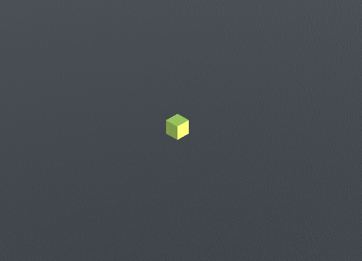
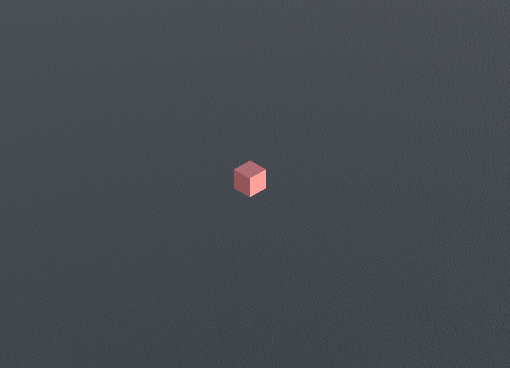
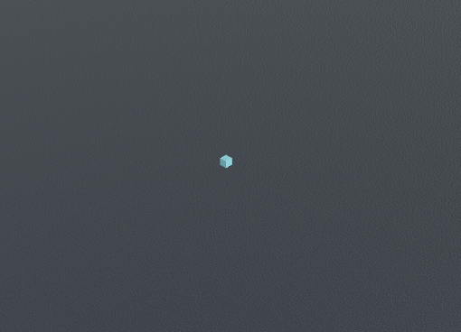
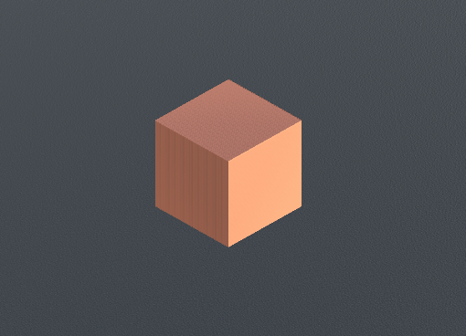
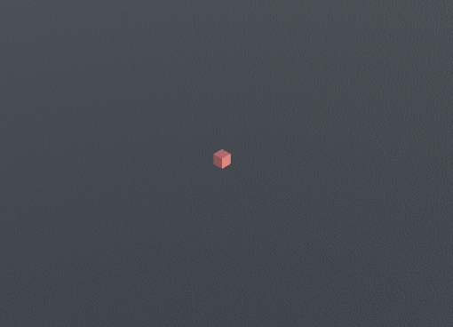
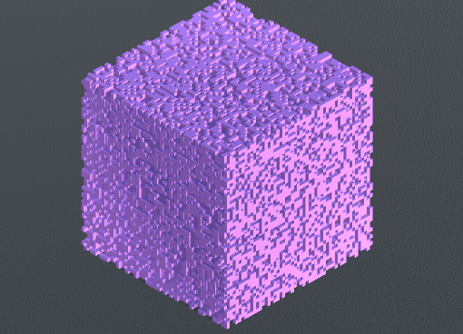

# 3D Cellular Automata
This prjects aims to visualize and simulate Cellular Automata in a 3-Dimensional space. The project was made using unity and C#. The simulations work on a given set of rules those being survival, birth and death timer. The survival determines the number of surrounding cells required for a cell to survive to the next phase/tick. The birth factor determines whether an unocupied area can spawn a cell dependning on the number of surrounding alive cells. The death timer is the number of phases/ticks it takes for a cell to go from being alive to being completely dead.

## Moore vs Von Neuman
Moore and Von Neuman are different methods of determining how many neighbouring cells exist for a given cell. Moore can have a total of 26 cells whereas Von Neuman can have only a total of 8 cells.

### Moore
Moore defines a neighbouring cell as one of which is within the 3x3x3 surrounding cells with the test cell being the center. This can be though of as a rubix cube with the center block/cell being the tested cell.

### Von Neuman
Von Neuman defines a neighbouring cell as one of which shares a face with the cell being tested. This means that neighbours can only exist at each of the 8 faces of a cuboid cell.

## Cellular Automata Examples

### Itteration/Phase Controls
The project harbours itteration/phase controls which allow the simulation to be paused at any given phase. The controls allow for phases to be played individually or simultaneously. The project also has two camera views one using orthographic projection and the other using perspective.

### Rule 445
|Survival|Birth|Death|Method|
|:---:|:---:|:---:|:---:|
|4|4|5|Moore|

### Amoeba
|Survival|Birth|Death|Method|
|:---:|:---:|:---:|:---:|
|9-26|5-7, 12, 13, 15|5|Moore|

### Clouds
|Survival|Birth|Death|Method|
|:---:|:---:|:---:|:---:|
|12-26|13, 14|2|Moore|

### Crystal Growth
|Survival|Birth|Death|Method|
|:---:|:---:|:---:|:---:|
|1-6|1, 3|2|Von Neuman|

### Diamond Growth
|Survival|Birth|Death|Method|
|:---:|:---:|:---:|:---:|
|5, 6|1-3|7|Von Neuman|

### Nuclei
|Survival|Birth|Death|Method|
|:---:|:---:|:---:|:---:|
|21-26|3, 4, 14, 23, 25|7|Moore|

### Pulsing Cell
|Survival|Birth|Death|Method|
|:---:|:---:|:---:|:---:|
|21-26|3, 4, 14, 23, 25|6|Moore|

### Pulsing Tesseract
|Survival|Birth|Death|Method|
|:---:|:---:|:---:|:---:|
|21-26|3, 4, 14, 23, 25|5|Moore|

### Pyroclastic
|Survival|Birth|Death|Method|
|:---:|:---:|:---:|:---:|
|4-7|6-8|12|Moore|

### Replicating Cube
|Survival|Birth|Death|Method|
|:---:|:---:|:---:|:---:|
|1-3, 7-9, 11-13, 18, 21, 22, 26|1, 3, 13, 17, 20-2|4|Moore|

### Slow Decay
|Survival|Birth|Death|Method|
|:---:|:---:|:---:|:---:|
|1, 4, 8, 11, 13-26|13-26|5|Moore|

### Spike Ball
|Survival|Birth|Death|Method|
|:---:|:---:|:---:|:---:|
|1-3, 7-9, 11-13, 18, 21, 22, 24, 26|3, 13, 17, 20-26|4|Moore|

